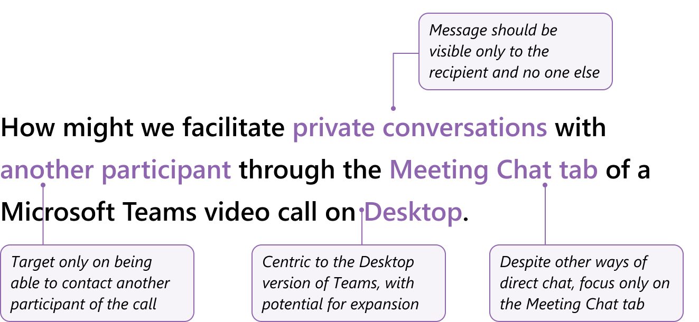
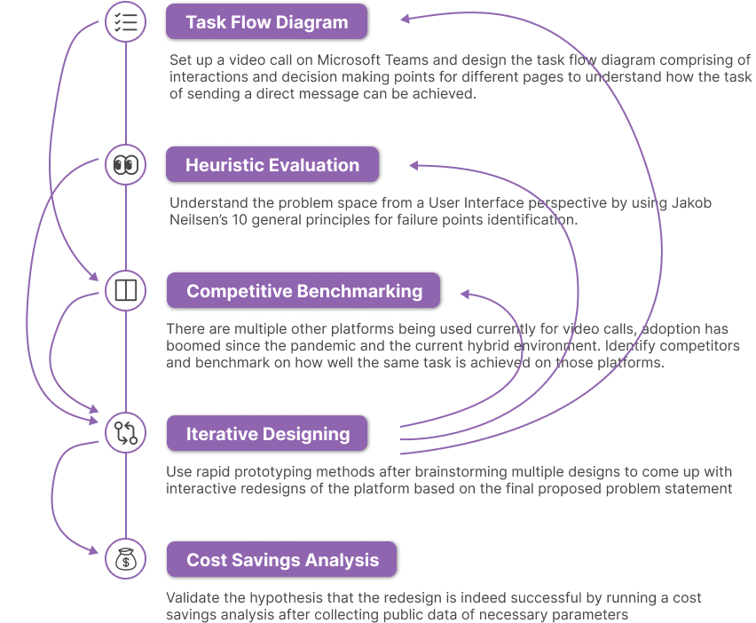
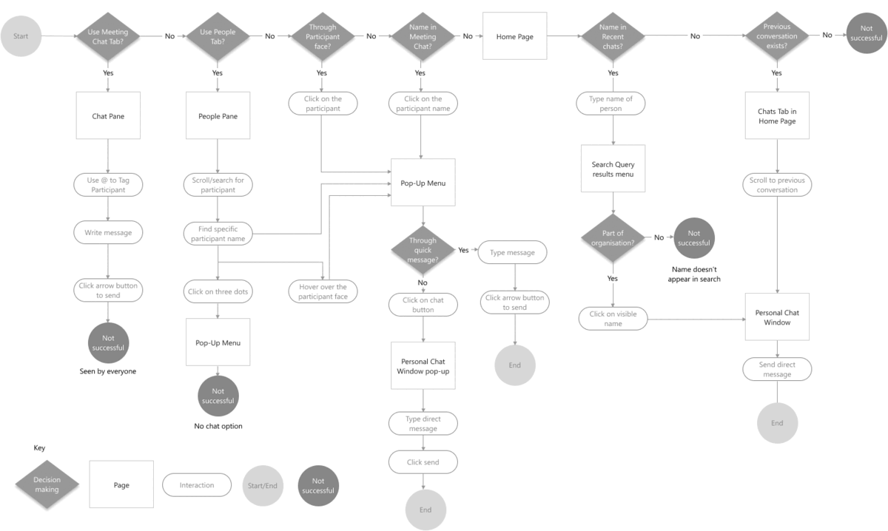
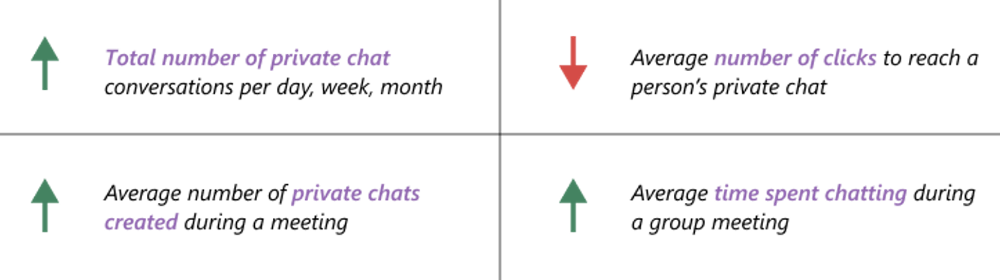

# Microsoft Teams Chat

Project Description: Facilitate private conversations with another participant through the Meeting Chat tab
My Role: Product Management, UI Design, User Experience Design

## Brief

There are multiple ways to send someone a message on Microsoft Teams, both in private or in a group setting. I came up with problem statement was “How might we quickly contact during a Microsoft Teams video call”, which post research became the following:

The project is done for the course - **Designing Smart Systems** that focused on the design of systems that learn and adapt as they gather more information over time. 

---

## Approach

My approach involved a mixture of primary research and secondary research. This was then followed by designing a few iterations and testing them with users to get feedback and balance that with a cost savings analysis.

---

## Research

- **270mn** Monthly Active Users of Microsoft Teams worldwide in 2022. [*Source](https://www.zdnet.com/article/microsoft-teams-now-has-more-than-270-million-monthly-active-users/)’*
- **91** of the Fortune 100 companies use Microsoft Teams. [*Source](https://mspoweruser.com/microsoft-teams-91-of-the-100-largest-companies/#:~:text=Today%2C%20Microsoft%20has%20revealed%20an,better%20when%20compared%20to%20Teams.)*
- **230k**+ educational institutions around the world use this platform. [*Source*](https://www.vyopta.com/blog/business-collaboration/schools-turn-to-microsoft-teams-as-distance-learning-grows/#:~:text=Microsoft%20reports%20that%20more%20than,features%20specifically%20aimed%20at%20educators.)

I onboarded a few regular users of video calling platforms through a survey and after creating the protocol ran usability testing sessions to gauge differences in platforms.

|  | Send direct message 
through Meeting Chat Tab? | What comes first - Participant or Message? | Search participant in Meeting Chat Tab? |
| --- | --- | --- | --- |
| Teams | No | Participant | No |
| [Zoom](https://www.notion.so/Explore-Zoom-8be8c7067fa540d1b79aeee6384d4e77?pvs=21) | Yes | Either | Drop down |
| [GMeet](https://www.notion.so/Explore-GMeet-70115ba21afd469c98c02866f0fe9e13?pvs=21) | No | None | No |
| [Gather](https://www.notion.so/Explore-Gather-155c7f46f7e0442cbb8424bf91ca474e?pvs=21) | Yes | Either | Search bar |

---

## Design

I started off with three simple ideas to incorporate the proposed considerations in different ways. The final solution was chosen because it 

- **Search bar**, which lists participants to ensure recognition before need for recall.
- **No chat pop-ups** over the incoming video stream, hence not affecting visibility of vital components of a video call.
- **Semi-persistant visibilty** of previous chats done during the meeting with full name visibility and preview of previous chats.
- The user has the **flexibilty** of keeping the direct chat drop down open or not.

---

## Results

I have ideated the quantitative metrics that could be measured. These metrics would need to be benchmarked before the feature roll-out and after while making sure no other changes were made on the platform that could affect these numbers. 

- This solution can lead to upto **$9/professional/year** in cost savings for businesses
- The proposed design serves as an important starting point to run a deeper and large scale effort into analyzing participant’s chatting habits during meetings.

---

## Reflections

- **Big platforms don’t have big problems.** Each problem seems small, but collectively if solved can lead to high returns.
- **Form and Function are interconnected.** UI**≠**UX is true, but it might be better put as UI⊂UX. The interface design is a subset of the entire user experience.
- **Always be cognizant of User’s Mental Models.** Careful consideration needs to be given since mental models become rigid and users become resistant to change.

**Always be cognizant of User’s Mental Models, even if they were established by your competitors.**

While proposed features and designs within platforms should be internally consistent through type, color, icon, etc usage, it is also important to be consistent with what the industry standards are. You need to be differentiated from your competitiors, but careful consideration needs to be given since users mental models become rigid over time and people become resistant to change, even across platforms. 

[https://youtu.be/kHoY9H9GFvg](https://youtu.be/kHoY9H9GFvg)

## **Contact**

[📧 mjtanyagupta@gmail.com](mailto:mjtanyagupta@gmail.com)

[🔗 linkedin.com/in/tanyagupta10](https://www.linkedin.com/in/tanyagupta10/)